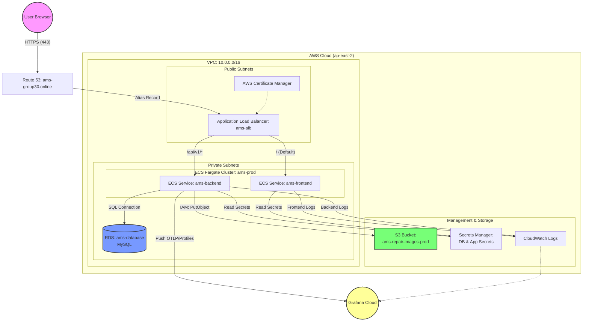
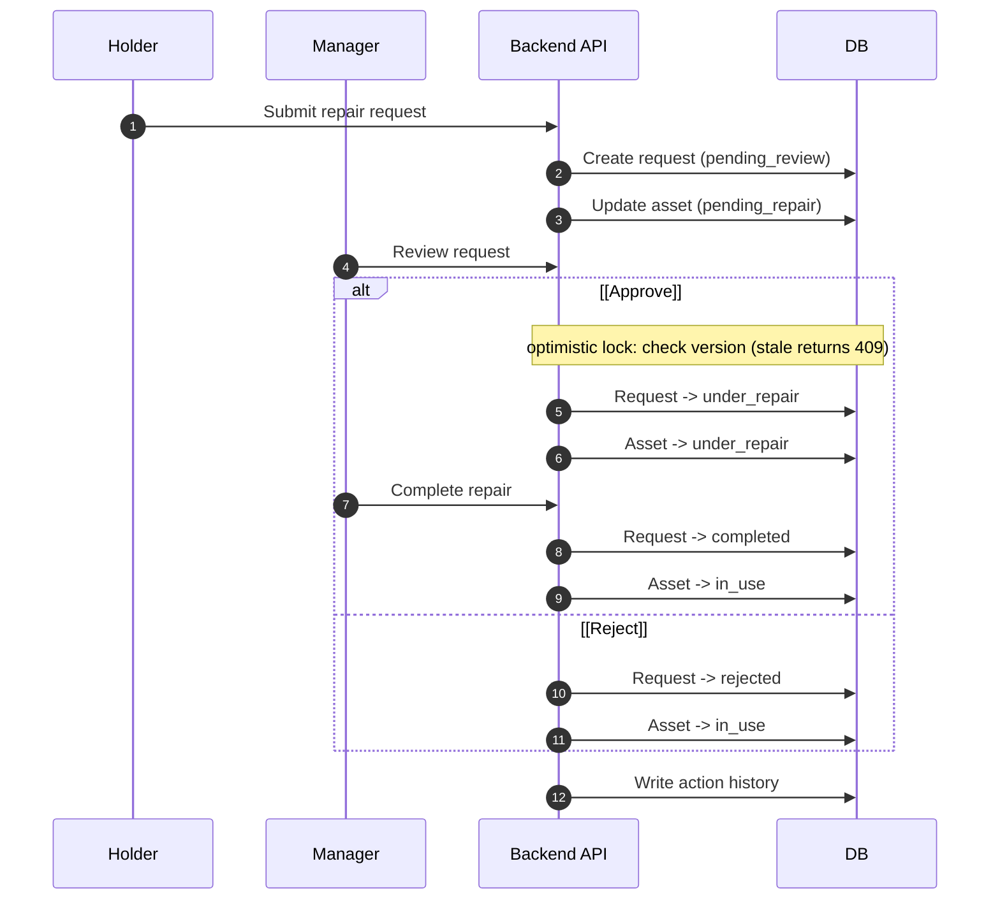
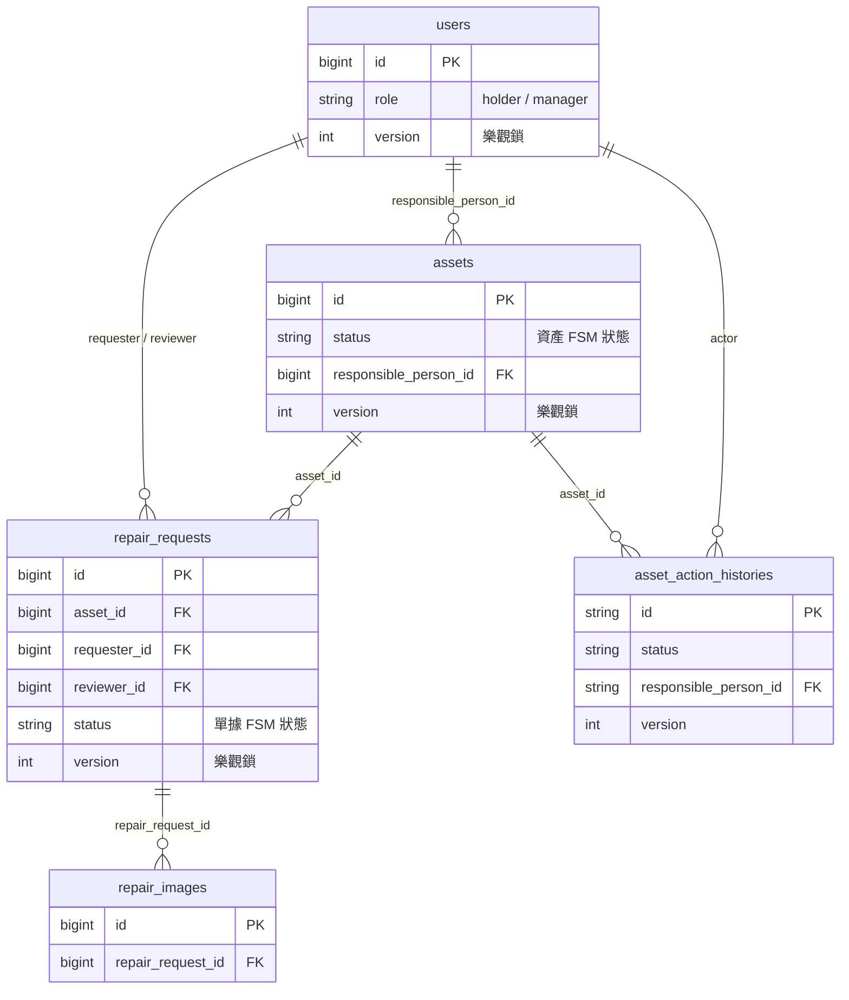
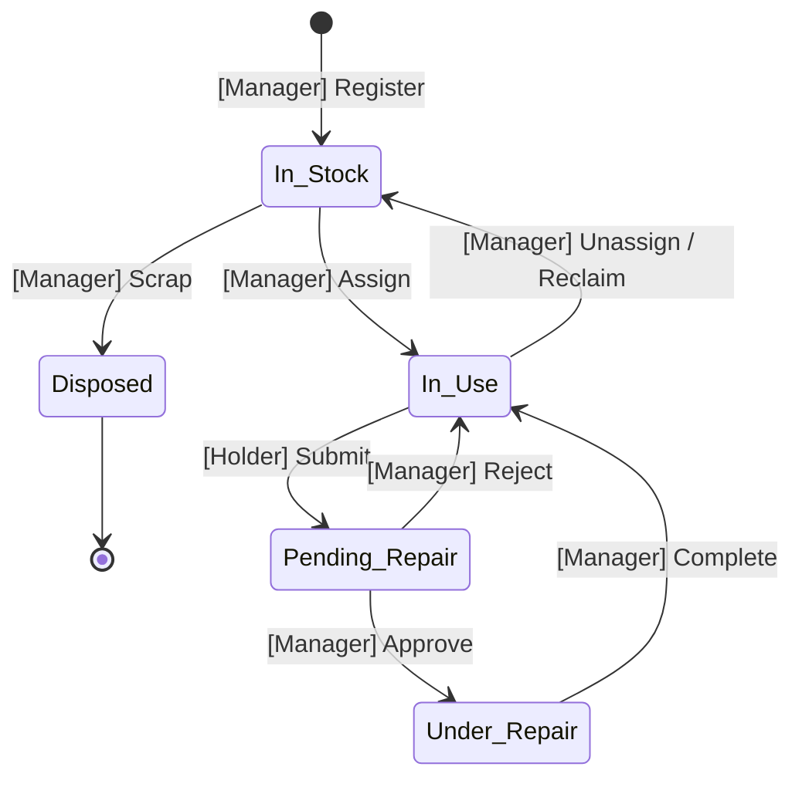

# 期末報告 — 簡報骨架（Slide Deck Draft）

> 對應文件：[`presentation-requirements.md`](./presentation-requirements.md)。
> 本檔案是 **骨架**，不是成品簡報：一個區塊代表一頁投影片，
> 內容包含對應的評分項度、所需視覺素材、口頭重點、時間預算。
> 實際簡報請在 Keynote / Google Slides / Slidev 上依此大綱製作。

## 簡報設計原則

1. **一頁只講一件事。** 一頁有兩個重點就拆成兩頁。
2. **圖優於字。** 預設每頁一張截圖或圖表，最多搭配 3–5 條簡短條列，
   絕對不貼整段文字。
3. **每頁頁尾打上對應評分項度的標籤**（例如 `30% 需求轉換`），方便
   評審一眼對應到評分欄位，也方便我們繳交前自我檢查有沒有漏。
4. **不要 raw AI 輸出。** 每條 bullet 改成自己的話，刪掉 AI 套版裝
   飾，icons 也要重新挑過。
5. **內文不使用 em dash。** 用逗號、冒號或括號代替。
6. **講稿（speaker note）要短。** Speaker note 是「講者開口要說的
   話」，不是「螢幕上顯示的字」，每頁 1–2 句即可。

## 素材標記說明（本骨架內的狀態標記）

每頁多了一列「**素材狀態**」，製作簡報時照著取用：

- ✅ **已備妥**：素材檔已放進 `docs/slides/assets/`，括號內為檔名。
- 🔲 **待製作**：尚未產出，後面接「應該長什麼樣」的說明；若要存成檔
  案，會給建議檔名，否則就是在簡報軟體內直接畫。
- 🎬 **影片待錄**：由團隊用 Playwright `demo` 專案錄製。

完整一覽見文末「素材狀態對照表」。

## 簡報時間預算（目標：簡報 + Demo 約 12 分鐘）

| 段落 | 投影片 | 目標時間 |
|------|--------|----------|
| A. 開場 + 分工 | 2 頁 | 1.0 min |
| B. 需求轉換與實作（30%） | 3 頁 | 1.75 min |
| C. 架構設計（25%） | 3 頁 | 2.0 min |
| D. Live Demo（預錄影片） | 1 頁 + 影片 | 2.5 min |
| E. 測試與驗證（25%） | 3 頁 | 2.0 min |
| F. 程式碼品質（10%） | 2 頁 | 1.0 min |
| G. 運維與可靠性（10%） | 3 頁 | 1.5 min |
| H. 收尾與 Q&A | 1 頁 | 0.25 min |
| **總計** | **18 頁** | **約 12.0 min** |

公告把每組簡報調成 12–15 分鐘，我們刻意落在 12 分鐘的低標、不塞到
15 分鐘：留緩衝給 Demo，也把時間讓給 Q&A（教學團明確建議精煉內容、多
留提問時間）。響鈴節點（公告調整後）：**10 分鐘第一次提醒、12 分鐘第
二次提醒、15 分鐘強制結束並開始 Q&A、20 分鐘換下一組。**

節奏檢查：10 分鐘第一次響鈴時，至少要已經講到 E 段（測試）；若還沒，
請壓縮 F、G 的深度，**絕不砍 D 段 Demo 或 C 段的必要圖面（系統架構 /
Sequence / ER）**。無論如何要在 15 分鐘強制結束前收尾，把剩下時間留給
評審提問。

---

## A 段 — 開場 + 分工（1.0 min）

### Slide 1 — 標題頁
- **評分項度：** —
- **視覺：** 專案 Logo / 管理員儀錶板的 Hero Shot（含 KPI 卡片）。
  右上角放組名、課程、日期 2026-06-02。
- **素材狀態：** ✅ `assets/fe-manager-dashboard.png`（管理員儀錶板
  KPI Hero）。
- **條列：**
  - 資產管理系統 / Asset Management System
  - 雲端計算與軟體工程，期末專題
  - 組員名單一行帶過(細節留到下一頁)
- **講稿：**「我們做的是企業級資產管理系統，覆蓋從持有者送修到管理
  員結案的完整維修流程，現在已經部署到 AWS 上跑了。」

### Slide 2 — 組員與分工
- **評分項度：** —（建立可信度背書）
- **視覺：** 左半部一張 5×5 熱力圖（成員 × 領域，每格用 ● 顯示投入
  程度）；右半部每人一行 headline 條列。簡報上用 icons 代替「●●●」
  也可以，但保持每格的相對強度。
- **素材狀態：** 🔲 簡報軟體內製作：把下面的 ASCII 表畫成視覺化色塊
  或 icons（深淺對應投入程度），不要直接貼 markdown 表格。
- **熱力圖（簡報上請畫成視覺化色塊，不要貼這張 ASCII 表）：**

  | 成員 | BE | FE | QA | Infra | PM/Docs |
  |------|:--:|:--:|:--:|:-----:|:-------:|
  | 劉仲楷 | Backend FSM + Audit log |  |  | CI/CD + Grafana Cloud | Roadmap + Docs |
  | 古庭榮 | Auth / Asset / Repair API| Manager Dashboard +Antd Design Token |  |  |  |
  | 鄭怡文 |  | i18n 框架 + 前端重構 | Unit + Integration + E2E Test |  |  |
  | 陳亮諭 |  | Asset List + Manager Page + 多維篩選 + 分類列舉 |  |  | Slides + Presentation |
  | 闕中豪 |  | Antd Layout + 主題切換 + Holder Pages |  | AWS Production 基礎設施 + ALB HTTPS + 域名 |  |

- **講稿：**「五位組員，每人都有清楚的主領域，BE、FE、QA、Infra、
  PM 都有人扛，接下來簡報每一塊都對應得到負責人，Q&A 也可分區回
  答。」

---

## B 段 — 需求轉換與實作，30%（1.75 min）

### Slide 3 — 我們在為哪兩種使用者解決問題
- **評分項度：** 30% 需求
- **視覺：** 並排放兩個 Persona 的 Empathy Map（持有者佳慧 / 管理員
  大偉）。四象限版型：Say / Do / Think / Feel。每象限挑一句訪談原話
  放上去，避免內容變空泛。
- **素材狀態：** 🔲 簡報軟體內製作：左右兩張四象限（Say / Does /
  Thinks / Feels）Empathy Map。內容直接用下面這幾句（取自
  `docs/system-design/01-user-story.md`，免再翻文件）：
  - **持有者佳慧**：Say「上次填的維修申請，現在到哪個階段了？有沒有
    辦法查？」／Does：送修兩三天沒消息就主動用通訊軟體追問／Thinks
    「設備送修期間我要怎麼工作？有沒有備用機可以借？」／Feels：無法
    追蹤進度而焦慮，不知設備何時回來，排不了後續工作。
  - **管理員大偉**：Say「這張單我剛要處理，才發現同事也在跑同一
    張。」／Does：靠口頭協調分工避免重工／Thinks「我更新了狀態，同
    事不一定看得到，兩人同時動同一張怎麼辦？」／Feels：用個人協調代
    替系統機制，有「什麼都做了卻什麼都沒解決」的無力感。
- **條列（圖下方說明字串）：**
  - 持有者痛點：無法查維修進度、只能用文字描述故障難以講清楚、不知
    道何時可以拿回設備、業務安排被打亂。
  - 管理員痛點：一天 50 張單、同一張單兩人搶處理、「維修中」狀態太
    粗糙、無法給準確完修時間。
- **講稿：**「這兩個痛點是我們訪談來的，不是空想。系統要做的事就是
  把這兩個痛點消掉。」

### Slide 4 — User Story 與 Acceptance Criteria
- **評分項度：** 30% 需求
- **視覺：** 上半部小卡網格列出所有主要 User Story 標題，下半部 zoom
  in **一則** 完整 AC。建議放「持有者上傳照片並送出維修申請」這一則，
  因為它一次涵蓋圖片上傳 + FSM 狀態轉移 + 重複申請阻擋三條規則。
- **素材狀態：** 🔲 簡報軟體內製作。內容直接用下列（取自
  `docs/system-design/01-user-story.md`，免再翻文件）：
  - **上半 User Story 小卡（共 6 則）：**
    - US-01（佳慧）提交設備維修申請
    - US-02（佳慧）查詢維修申請進度
    - US-03（佳慧）查看個人持有設備清單
    - US-04（大偉）審查並推進維修申請流程
    - US-05（大偉）查詢所有設備狀態與保固資訊
    - US-06（大偉）登記新採購設備入庫
  - **下半 zoom in 的 AC（用 US-01，剛好一次涵蓋圖片上傳 + FSM 轉
    移 + 重複申請阻擋）：**
    1. 填資產編號與故障描述後可提交，顯示成功並產生唯一申請單編號。
    2. 提交後申請單狀態為「待審查」。
    3. 可選擇上傳故障照片，成功後附於申請單供管理人員查看。
    4. 【邊界】故障描述為空 → 不允許提交，標示必填未填。
    5. 【邊界】資產編號不存在 → 拒絕提交並提示編號無效。
    6. 【邊界】設備已為「維修中」→ 禁止重複提交。
- **條列：**
  - 共 6 條 User Story（US-01 ~ US-06），分布於資產基礎資訊管理與維
    修流程兩個模組。
  - AC 格式：Given / When / Then 加上負向案例。
  - 展示故事：「身為持有者，我可以為手上的資產送出維修申請，附上一
    張故障照片，並查詢申請狀態」。
- **講稿：**「這則 Story 對應到後來的三個生產功能：圖片上傳、
  pending_repair 的 FSM 轉移、重複申請阻擋。」

### Slide 5 — 我們交付的範圍
- **評分項度：** 30% 需求
- **視覺：** 模組地圖。上層兩根柱子（資產基礎資訊 / 維修流程），下層
  基礎設施列（RBAC、i18n zh-TW + en、可觀測性、CI/CD），每塊上面打勾
  代表已完成。右下角放一張小截圖，秀出語言切換器，證明 i18n 真的
  上線。
- **素材狀態：**
  - 🔲 簡報軟體內製作：模組地圖。內容（免再翻文件）：
    - **柱一 資產基礎資訊管理：** 資產登記與分類（唯一編號）、採購入
      庫（型號 / 規格 / 供應商 / 採購金額）、詳細屬性（地點 / 負責人 /
      使用部門 / 保固）、資產狀態。
    - **柱二 申請單管理：** 申請 → 審查（同意 / 拒絕）→ 維修中（填維
      修日期 / 內容 / 方案 / 費用 / 廠商）→ 維修完成；含歷史維修查詢。
    - **基礎設施列（每塊打勾）：** RBAC、i18n（zh-TW + en）、可觀測
      性、CI/CD。
  - ✅ `assets/fe-holder-asset.png`（持有者資產清單；語言切換器在頂
    欄。若切換器未入鏡，再補一張裁切的切換器特寫）。
- **條列：**
  - 資產 CRUD、多維度查詢、由 FSM 驅動的狀態欄。
  - 持有者送出 → 管理員審核 → 維修中 → 完工，含圖片上傳與審計軌跡。
  - RBAC（持有者 vs 管理員）、雙語介面、可抽換的圖片儲存層。
- **講稿：**「需求文件裡寫的全部上線了。進階項目（i18n、並發控制、
  圖片上傳）也都上線了。」

---

## C 段 — 架構設計與可擴展性，25%（2.0 min）

### Slide 6 — 技術選型與架構模式
- **評分項度：** 25% 架構
- **視覺：** 三層 Logo 圖。上層：React 18 + Vite + TypeScript + Ant
  Design v6；中層：FastAPI + SQLAlchemy + Alembic + MySQL 8；下層：
  AWS ECS + ALB + RDS Multi-AZ + S3 + Grafana Cloud。
- **素材狀態：** 🔲 簡報軟體內製作：三層技術棧 Logo 圖（各層放官方
  Logo，由前端到基礎設施）。
- **條列：**
  - Modular Monolith。Peak 約 4 QPS，沒有微服務化的壓力，HA 從平台
    層取得，不從拓樸層取得。
  - Optimistic Locking（`version` 欄位），不用 `SELECT ... FOR
    UPDATE`，因為寫入競爭低、讀取要快。
  - `ImageStorage` Protocol：同一個 DB key 在 Dev（本機磁碟）和
    Prod（S3）兩種後端都通用，切換不需要資料遷移。
- **講稿：**「我們刻意挑了無聊的技術棧。有趣的決策不是『選了什
  麼』，而是『怎麼部署』。」

### Slide 7 — Production AWS 架構 + 可擴展性（必要圖面）
- **評分項度：** 25% 架構（含可擴展性）
- **視覺：** 整頁的 AWS 架構圖。Browser → Route53 → ALB（HTTPS、ACM
  憑證、HTTP→HTTPS 301）→ ECS Fargate Service（backend + frontend，
  滾動部署）→ RDS MySQL Multi-AZ。S3 bucket 用於維修照片，透過 ECS
  Task Role 授權。側邊流向：OTLP/HTTP 出口到 Grafana Cloud（Metrics
  + Loki + Tempo + Pyroscope）。可選：在 backend / frontend service
  疊一個 Auto Scaling 虛線框，箭頭顯示 desired count 可以 1 → N 動態
  擴展，作為可擴展性的視覺佐證。
- **素材狀態：** ✅ 已草擬（下方 Mermaid，依實際部署拓樸：region
  ap-east-2、VPC public / private subnet、ACM、Secrets Manager、
  CloudWatch、路徑路由 `/` → 前端、`/api/v1/*` → 後端），可渲染為
  `assets/aws-architecture.png`。註：GitHub Actions OIDC → ECR / ECS
  的部署流在 Slide 15 呈現，本圖聚焦執行期拓樸；RDS Multi-AZ 與 ECS
  Auto Scaling（1 → N）可在渲染時於圖上加註。

- **條列：**
  - **高可用：** ALB 跨 AZ、ECS desired-count ≥ 2、RDS Multi-AZ。
  - **零停機部署：** ECS Rolling 配合 `wait-for-service-stability`、
    部署前先以 one-off task 跑 `alembic upgrade head`；Liveness
    `/health` 與 Readiness `/ready` 分離，讓 RDS 失效切換時 ALB
    drain 目標而非殺容器。
  - **水平擴展：** Frontend / Backend 都是無狀態 ECS 服務，流量上升
    只要把 desired count 拉高，ALB 會自動把流量分到新加進來的 task;
    DB 走 RDS Multi-AZ，垂直擴 instance 規格即可;圖片走 S3，本身
    就是水平擴展服務，不用我們煩惱容量。
- **講稿：**「這頁同時答兩個問題:一個 AZ 掛掉怎麼辦(平台層 HA)，
  以及流量翻倍怎麼辦(無狀態 ECS 水平擴展)。」
- **Q&A 防守備案（不放在簡報、留給講者口頭回答)：** 若評審問「再
  下一步呢?」，回答:(1)讀寫分離:加 RDS Read Replica，把高頻查
  詢路由到 replica，配合既有 query metrics 判斷觸發點;(2)CDN /
  Edge Cache:S3 前掛 CloudFront，讓圖片不再經過 ALB;(3)Cache
  層:Redis 處理熱門資產的基本資訊查詢。這些都已寫進
  `docs/system-design/06-phase3-architecture.md`，現在沒做是因為實
  測指標還沒踩到觸發條件。

### Slide 8 — 維修流程 Sequence + Data Model（必要圖面，合併）
- **評分項度：** 25% 架構
- **視覺：** 左右分割版面。**左半**：Sequence Diagram（Holder →
  Frontend → Backend → MySQL、圖片走 S3）。標出三個資產狀態轉移
  pending_repair → under_repair → in_use，並在「管理員審核同意」這
  一步強調 `version` 檢查（傳入舊版本回 409）。**右半**：ER 圖
  （`users`、`assets`、`repair_requests`、`repair_images`），標出
  `version` 欄位、外鍵以及搜尋用的複合索引
  `(category, status)`、`(department, location)`。
- **素材狀態：**
  - ✅ 左半 Sequence 已草擬（下方第一個 Mermaid，依實際 FSM 轉移與
    optimistic lock 競態），可渲染為 `assets/sequence-repair-flow.png`。
  - ✅ 右半 ER 已草擬（下方第二個 Mermaid，依 `07-database-design.md`
    真實 schema），可渲染為 `assets/er-model.png`。
  - ⚠️ 版面提醒：這是全 deck 最密的一頁（兩張圖 + 條列）。兩張都要渲
    染成精簡版（Sequence 走直式、ER 只留四張核心表），條列在簡報上壓
    到 1 行；若投影出來仍嫌擠，就把 Sequence 拆成獨立一頁。

> 註：真實 schema 另有一張 append-only 稽核表
> `asset_action_histories`（每次 FSM 轉移寫一列），若想凸顯審計軌跡
> 可加進 ER；本圖依需求書指定的四張核心表呈現。複合索引以實際遷移
> 為準：`(category, status)`、`(department, location)`、
> `(status, created_at)`。`version` 只在 `users` / `assets` /
> `repair_requests` 三張可變表上，`repair_images` 沒有。

- **條列（圖下方一行串起兩半)：**
  - 同一個 transaction 內同時更新 asset 與 repair request，配合
    `version` 檢查防止管理員競態。
  - Schema 刻意維持四張表的狹窄結構，索引依真實查詢形狀設計。
  - `repair_images.image_url` 存的是 storage key 而非 URL，所以同一
    筆資料在本機磁碟與 S3 兩種後端都通用。
- **講稿：**「左邊看的是『一次審核怎麼跑』，右邊看的是『資料怎麼
  存』，重點都是中間的 `version` 欄位:它讓 Sequence 上的競態被擋
  下，也是 ER 上唯一非 PK 的關鍵欄位。」

---

## D 段 — Live Demo（2.5 min）

### Slide 9 — Demo 影片（預錄，由 Playwright 產生）
- **評分項度：** 30% 需求（佐證）+ 25% 架構（佐證）
- **視覺：** 整頁嵌入預錄的 Demo 影片，由 Playwright `demo` 專案
  （`holder-journey` + `manager-journey`，headed 模式、500 ms
  slow-mo）匯出的 WebM/MP4。播放時段內角落顯示流程編號 1 → 4 對應
  腳本步驟，方便講者旁白指認。
- **素材狀態：** 🎬 待錄 → `assets/demo.mp4`（團隊準備，剪成約 2
  分鐘）。靜態 poster / 首幀可先用 ✅ `assets/fe-login.png` 墊著，方
  便排版時佔位。
- **影片內容（約 2 min，預先剪好）：**
  1. **持有者登入 → 上傳一張照片並送出維修申請。** 看到資產狀態從
     `In_Use` 轉成 `Pending_Repair`，順手秀一次 i18n 切換。
  2. **管理員儀錶板。** KPI 卡片、資產分類長條圖、維修工作量、最近
     待審清單與點進去的深層連結。
  3. **管理員審核同意。** 背景跑 optimistic lock，資產進入
     `Under_Repair`，填寫維修方案與金額後按下完工，資產回到
     `In_Use`。
  4. **切到 Grafana 分頁。** 剛剛這一筆請求出現在延遲面板，並能從
     面板點到對應的 Trace。
- **講稿：**「為了精準守住節奏（不被 15 分鐘強制結束打斷），我們把
  Demo 預先用 Playwright 跑過並錄下來，這也代表這四個流程已經是 E2E
  測試的一部分，每次 push 都會在 CI 上跑一遍。」

---

## E 段 — 測試與驗證，25%（2.0 min）

### Slide 10 — 測試金字塔（真的三層）
- **評分項度：** 25% 測試
- **視覺：** 真實三層的測試金字塔，由下到上：
  - **底層 Unit Tests：** Backend 約 400+ 個（純函式 / 業務邏輯 /
    FSM 規則 / 表單驗證）。Frontend 約 150+ 個元件與 hook 測試。
  - **中層 Integration Tests：** Backend 約 80+ 個（FastAPI
    TestClient 打真實 API，配合資料庫 fixture），覆蓋每條路由與
    RBAC、生命週期串接。
  - **頂層 E2E Tests：** Playwright 25 個測試、16 個 spec 檔，覆蓋
    6 條關鍵流程（登入、持有者上傳照片送出維修、管理員審核、結案、
    登錄資產、多維度搜尋）。
- **素材狀態：** 🔲 簡報軟體內製作：三層金字塔（底寬頂窄），每層標
  上數量。
- **條列：**
  - **Backend** 總覆蓋率 96.3%（pytest --cov，上傳至 SonarCloud）。
  - **Frontend** 總覆蓋率 94.7%（vitest），也在 CI 每次 push 上傳。
  - 三層都在 CI 跑，並做 path-filter，動到哪邊就跑哪邊。
- **講稿：**「我們用數字說話，不用形容詞。下層數量多、跑得快;上層
  數量少、抓真實互動，這是真的三層金字塔。」

### Slide 11 — 我們證明的難測案例
- **評分項度：** 25% 測試
- **視覺：** 三宮格矩陣，每一格寫一個風險與對應測試。
- **素材狀態：** 🔲 簡報軟體內製作：三宮格矩陣（每格一個風險 + 對應
  測試）。

| Capability | Holder | Manager |
|-----------|--------|---------|
| View own assets | ✓ | — |
| View all assets | — | ✓ |
| Register/edit/assign assets | — | ✓ |
| Submit repair request | ✓ | — |
| View own repair requests | ✓ | — |
| View all repair requests | — | ✓ |
| Approve/reject/complete repairs | — | ✓ |
| View images on any request | ✓ | ✓ |
| View manager dashboard summary | — | ✓ |

- **條列：**
  - **FSM 不變式：** 20 個參數化案例，覆蓋所有合法與不合法的狀態
    轉移。任何違反 FSM 的呼叫會在 API 層被擋下。
  - **RBAC 矩陣：** 持有者 vs 管理員 × 每一個 endpoint，連負向案例
    都驗證。
  - **同時審核競態：** 兩位管理員同時審核同一張單，輸的那一邊收到
    409，不是被靜悄悄覆寫。
- **講稿：**「這些是會在 Production 咬人的案例，每一個都有先紅後綠
  的測試把它釘住。」

### Slide 12 — 壓力測試
- **評分項度：** 25% 測試
- **視覺：** 以 **單一** Grafana Cloud Prometheus 同時段面板為主視覺，
  k6 摘要數字（p50 / p95 / p99 延遲、錯誤率、Throughput）以文字疊在角
  落。不要把兩張密集截圖並排，會擠到看不清。
- **素材狀態：** 🔲 截圖待團隊提供。**本版簡報先略過壓測數字**（見下
  方條列），若 Buffer 週有時間再回填。
- **條列：**
  - `load/` 下有 6 種 k6 情境：smoke、load、stress、spike、soak、
    consistent（持續流量）。
  - 持續壓測直接打線上 ALB，端到端;指標透過
    `K6_PROMETHEUS_RW_*` 送到 Grafana Cloud Prom，可與其他面板對
    照。
  - 標題數字：本版暫略（團隊視時間於 Buffer 週回填，例如「在 Y RPS
    持續壓力下 p95 < X ms、錯誤率 0」）。
- **講稿：**「跑的是線上系統，不是 localhost，看的是和正式維運一樣
  的儀錶板。」

---

## F 段 — 程式碼品質，10%（1.0 min）

### Slide 13 — CI 上有哪些 Gate
- **評分項度：** 10% 程式碼品質
- **視覺：** 由左到右的管線圖，每一格代表一道 Gate，用 icon + 一行
  說明標出「擋什麼」。
- **素材狀態：** 🔲 簡報軟體內製作：左到右的管線圖，每格一道 Gate
  （icon + 一行「擋什麼」）。**8 道 Gate 的 strip 跟 `ci.png` 真圖二
  選一、別兩個都塞滿整頁**：想教「每道閘擋什麼」就用手繪 strip；想直
  接證明「每個 PR 真的在跑」就用 ✅ `assets/ci.png`（`ci.yml` PR 圖，
  正好看得到 3 個 pytest shard + 2 個 E2E shard）。
- **條列（這些就是我們的把關閘）：**
  - **Lint Gate：** 程式碼風格與常見錯誤;Backend ruff、Frontend
    ESLint 9。
  - **Type Gate：** 型別正確性;Backend mypy `--strict`、Frontend
    `tsc` strict。
  - **Unit + Integration Test Gate：** 紅燈就不能 merge，覆蓋率也
    在這裡計算。
  - **E2E Test Gate：** Playwright 跑 6 條關鍵流程。
  - **Secret Gate：** gitleaks 在本機 pre-commit 與 CI 各擋一次。
  - **SAST Gate：** Semgrep 跑 OWASP Top 10。
  - **SCA Gate：** pip-audit、npm-audit、Trivy 抓相依套件的 CVE。
  - **Quality Gate：** SonarCloud 統合覆蓋率、Bug、Code Smell、
    Security Hotspot，未過就不能 merge。
- **講稿：**「品質不是看心情，是看 Gate。任何一道紅燈，PR 都不會被
  merge。」

### Slide 14 — SonarCloud 截圖
- **評分項度：** 10% 程式碼品質
- **視覺：** SonarCloud 專案頁的整頁截圖：Quality Gate **Passed**，
  含 New Issues / Coverage / Duplications / Security Hotspots。
- **素材狀態：** ✅ `assets/SonarCloud.png`（Quality Gate 通過頁）。
- **條列：**
  - Quality Gate 在每個 PR 都是綠燈。
  - 覆蓋率同時涵蓋 Backend 96.3%（pytest）與 Frontend 94.7%
    （vitest），兩邊都在 CI 每次 push 上傳。
  - 報告連結就在 Repo README，評審可直接點進去驗證。
- **講稿：**「這頁在 Repo 的每個 PR 上都看得到，評審可以從我們的
  Repo 連結點進去驗證。」

---

## G 段 — 運維與可靠性，10%（1.5 min）

### Slide 15 — CI/CD Pipeline（執行中截圖）
- **評分項度：** 10% 運維
- **視覺：** 一張整頁的 `cd.yml`（on push）GitHub Actions 圖。它先重
  用整套品質工作流（ruff / mypy、frontend / vitest、SCA、SonarQube 等
  CI 閘），全綠後才進部署鏈：build-and-push（與品質閘平行）→ migrate
  （Alembic one-off task）→ deploy-backend / deploy-frontend 滾動部署
  → sync dashboards 到 Grafana。**一張圖就同時看得到 CI 把關與 CD 部
  署**，不需要再並排第二張。
- **素材狀態：** ✅ `assets/cicd.png`（`cd.yml` on push 全圖，含品質
  閘 + 部署鏈）。PR 端只跑品質閘的純 CI 圖另存 `ci.png`，用在 Slide
  13，這裡不重複放。
- **條列：**
  - **CI 與 CD 拆成兩個 workflow：** PR 跑 `ci.yml`（只把關，不部
    署）；push 到 main 跑 `cd.yml`，先重用同一套品質閘再部署。
  - **平行化把回饋砍快約一半：** pytest 切 3 shard、E2E 切 2 shard、
    `build-and-push` 與品質閘平行跑（不等 E2E / Sonar 跑完），CD 關鍵
    路徑再省約 1m20s。
  - Path-filtered：只動 frontend 的 commit **不會** rollout backend
    的 ECS service，反之亦然。
  - 部署透過 GitHub OIDC 取得 AWS Role，Repo 內沒有長效 AWS Key。
  - ECS 滾動部署配合 `wait-for-service-stability`，部署前以 one-off
    task 跑 Alembic migration。破壞性的 demo 重新 seed 拆成獨立、需手
    動觸發的 `seed.yml`，不掛在部署鏈上。
- **講稿：**「這張是 push 到 main 的全圖，先重用 PR 那套品質閘，全綠
  才往下部署。只有對的那一側會 rollout，錯側部署不是靠紀律，是設計上
  就不可能。」

### Slide 16 — 可觀測性：Grafana Cloud 儀錶板
- **評分項度：** 10% 運維
- **視覺：** Grafana Cloud 面板拼貼，依手上 3 張截圖做 **3 格** 的關
  聯走查（不硬湊四宮格、避免留一個空格）：
  - 指標面板：每個 endpoint 的 RED 指標（Rate / Errors / Duration）。
  - Loki 日誌：篩選到同一個 Trace ID。
  - Tempo：對同一筆請求的 Trace 時間軸。
  - （可選第 4 格）Pyroscope CPU Flamegraph，若 Demo 時段補截再加。
- **素材狀態：** ✅ `assets/grafana-01.png`、`assets/grafana-04.png`、
  `assets/grafana-05.png`（共 3 張，恰好對應上面 3 格）。要升成四宮格
  再補截 1 張 Pyroscope。
- **條列：**
  - OTLP/HTTP 從 backend 出口到 Grafana Cloud（Metrics + Logs +
    Traces + Profiles 同一個面板可串）。
  - **儀錶板與告警都是 as-code：** 儀錶板 JSON 與告警規則進版控，由
    CD 的 `sync dashboards` job 在每次部署時 push 到 Grafana Cloud，
    不靠人手在 UI 上點。
  - **告警是真的有接通的（不是只看板子）：** 7 條規則 × 2 段門檻
    （warning / critical），透過 Grafana provisioning API 佈署，違反
    就寄 email。每條都對應一個會在 Production 咬人的失效模式：
    - **p95 延遲** → 使用者可感知的慢。
    - **5xx 比率** → 正確性退化。
    - **DB 連線池飽和度 / 複寫延遲** → 容量與資料一致性。
    - **磁碟用量 / CPU** → 基礎設施飽和。
    - **`/health` 探針** → 服務根本沒在跑。
  - 端到端關聯走查已實測：儀錶板面板 → 同窗口 Loki 日誌 → Tempo
    Trace → Pyroscope Flamegraph 可互通。
- **講稿：**「這頁上的每個指標都對應到一個我們會擔心的失效情境，而且
  告警已經接到 email，板子不是擺好看的，壞了會有人收到通知。」

### Slide 17 — 可靠性機制
- **評分項度：** 10% 運維
- **視覺：** 三欄「若 X 失效，會發生什麼」對照表。
- **素材狀態：** 🔲 簡報軟體內製作：「若 X 失效 → 會發生什麼 → 對應
  機制」對照表（沿用下方條列）。
- **條列：**
  - **AZ 失效** → ALB 切到存活 AZ、RDS Multi-AZ 自動 failover、ECS
    重新調度。
  - **DB 短暫斷線** → `/ready` 回 503、ALB drain 目標、不會出現大
    量 5xx。
  - **管理員競態** → optimistic lock 回 409，重試是安全的。
  - **不良 Migration** → 部署前的 Alembic upgrade one-off task 失敗
    時直接中止 rollout。
  - **部署退化** → ECS 滾動部署在新版健康前不會殺舊版。
  - **以上機制若仍踩線** → Grafana 告警規則寄 email 通知，偵測到通知
    這一段是閉環的，不靠人剛好盯著板子。
- **講稿：**「我們不喊『高可用』口號，而是把每個失效模式列出來，
  每一個都標出對應的處理機制，最後再用告警把『有人會知道』補上。」

---

## H 段 — 收尾與 Q&A（0.25 min）

### Slide 18 — Thank You / Q&A
- **評分項度：** —
- **視覺：** 真的要簡潔，別把所有東西塞滿：專案名稱 + 一句 tagline、
  一個 QR Code（直接編碼線上 Demo URL，Repo 連結放小字一行就好，不要
  兩個 URL 都大字並列）、組員名字一行。KPI Hero Shot 只當**淡化背景**
  做首尾呼應，不要當成跟 QR / 文字搶版面的前景元素。
- **素材狀態：**
  - ✅ `assets/fe-manager-dashboard.png`（淡化當背景，首尾呼應標題頁
    KPI Hero）。
  - 🔲 待製作 → `assets/repo-qr.png`：QR Code（編碼線上 Demo URL）。
- **講稿：**「Q&A 開放，分工依 Slide 2 熱力圖:Joshua 接架構與運
  維、jnes0824 接 Backend API、Emma 接測試、Ryan 接 FE 業務頁、
  Chung Hao 接 AWS 基礎設施。」

---

## 對照表：評分項度涵蓋自我檢查

繳交前用這張表逐項勾掉：

| 權重 | 項目 | 對應投影片 | 狀態 |
|------|------|------------|------|
| 30% | 需求 | 3、4、5（+ Demo 為佐證） | [ ] |
| 25% | 架構 | 6、7、8 | [ ] |
| 25% | 測試 | 10、11、12 | [ ] |
| 10% | 程式碼品質 | 13、14 | [ ] |
| 10% | 運維 | 15、16、17 | [ ] |

繳交時任何一列沒勾掉，就不算定稿。

## 素材狀態對照表（Asset Manifest）

✅ 已備妥（檔案在 `docs/slides/assets/`）／🔲 待製作／🎬 影片待錄。

| 投影片 | 素材 | 類型 | 狀態 / 取得方式 |
|--------|------|------|------------------|
| 1、18 | 管理員儀錶板 KPI Hero | 截圖 | ✅ `fe-manager-dashboard.png` |
| 2 | 分工熱力圖 | 自製視覺 | 🔲 簡報軟體內製作（色塊 / icons） |
| 3 | 兩個 Persona Empathy Map | 自製視覺 | 🔲 簡報軟體內製作 |
| 4 | User Story 網格 + 一則 AC | 自製視覺 | 🔲 簡報軟體內製作 |
| 5 | 持有者資產清單（含語言切換器） | 截圖 | ✅ `fe-holder-asset.png`（切換器若未入鏡補裁切圖） |
| 5 | 模組地圖 | 自製視覺 | 🔲 簡報軟體內製作 |
| 6 | 三層技術棧 Logo 圖 | 自製視覺 | 🔲 簡報軟體內製作 |
| 7 | AWS 架構圖（實際部署拓樸） | 必要圖面 | ✅ 已草擬（本頁內含 Mermaid），可渲染為 `aws-architecture.png` |
| 8 左 | 維修流程 Sequence Diagram | 必要圖面 | ✅ 已草擬（本頁內含 Mermaid），可渲染為 `sequence-repair-flow.png` |
| 8 右 | ER Model | 必要圖面 | ✅ 已草擬（本頁內含 Mermaid），可渲染為 `er-model.png` |
| 9 | Demo 影片（poster 用 `fe-login.png`） | 影片 | 🎬 待錄 → `demo.mp4`（Playwright demo 專案，團隊準備） |
| 10 | 測試金字塔 | 自製視覺 | 🔲 簡報軟體內製作 |
| 11 | 難測案例三宮格 | 自製視覺 | 🔲 簡報軟體內製作 |
| 12 | 單一 Prometheus 面板 + k6 數字文字疊圖 | 截圖 | 🔲 團隊提供（壓測數字本版略過） |
| 13 | CI Gate 管線圖（佐證用 `ci.png`） | 自製視覺 | 🔲 簡報軟體內製作（佐證 ✅ `ci.png`，PR 純品質閘圖） |
| 14 | SonarCloud Quality Gate | 截圖 | ✅ `SonarCloud.png` |
| 15 | GitHub Actions：`cd.yml` on push 全圖（含 CI 閘 + 部署） | 截圖 | ✅ `cicd.png`（單張；`ci.png` 已用於 Slide 13，不重複） |
| 16 | Grafana 3 格關聯走查（RED / Loki / Tempo）+ 告警 as-code | 截圖 | ✅ `grafana-01.png`、`grafana-04.png`、`grafana-05.png`（3 張對 3 格；升四宮格再補 Pyroscope） |
| 17 | 可靠性失效對照表 | 自製視覺 | 🔲 簡報軟體內製作 |
| 18 | Repo QR Code | 自製視覺 | 🔲 待製作 → `repo-qr.png` |

## 簡報定稿前的待辦清單

已完成：

- [x] 前端 / SonarCloud / Grafana 截圖已放進 `docs/slides/assets/`
      （`fe-login`、`fe-manager-dashboard`、`fe-holder-asset`、
      `SonarCloud`、`grafana-01/04/05`）。
- [x] CI / CD 截圖已備妥：`cicd.png`（`cd.yml` on push 全圖，含品質閘
      + 部署，單張用於 Slide 15）、`ci.png`（`ci.yml` PR 純品質閘圖，
      用於 Slide 13）。兩張各用一次、不並排，避免擠到看不清。
- [x] 三張必要圖面都已用 inline Mermaid 草擬：AWS 架構（Slide 7，實際
      部署拓樸）、維修流程 Sequence（Slide 8 左）、ER Model（Slide 8
      右）。渲染成 PNG 為選配。
- [x] 覆蓋率數字回填：Backend 96.3% / Frontend 94.7%（Slide 10、14）。

待處理：

- [ ] （選配）把 Slide 7 / 8 的 inline Mermaid 渲染成 PNG
      （`aws-architecture.png`、`sequence-repair-flow.png`、`er-model.png`）。
- [ ] 錄 Demo 影片 → `assets/demo.mp4`，剪成約 2 分鐘並嵌入 Slide 9。
- [ ] Grafana 四宮格若缺第 4 象限，補截 1 張。
- [ ] 製作 Repo QR Code → `assets/repo-qr.png`。
- [ ] 自製視覺（分工熱力圖、Empathy Map、模組地圖、技術棧、測試金字
      塔、Gate 管線、可靠性對照表）在簡報軟體內完成。
- [ ] 決定最終配色（以 `docs/designs/DESIGN.md` 的 TSMC 色票為基礎，
      簡報上收斂到兩個重點色)。
- [ ] （選配）把真實的 Load Test 數字回填 Slide 12。
- [ ] 每段投影片指定講者，配合 10 / 12 / 15 分鐘三段響鈴做一次完整
      彩排，確認簡報 + Demo 在 12 分鐘內收尾、留 5–8 分鐘給 Q&A。
- [ ] 匯出為 PDF，內嵌字型，確認 < 25 MB，於 2026-06-03 00:00 前繳
      交。
