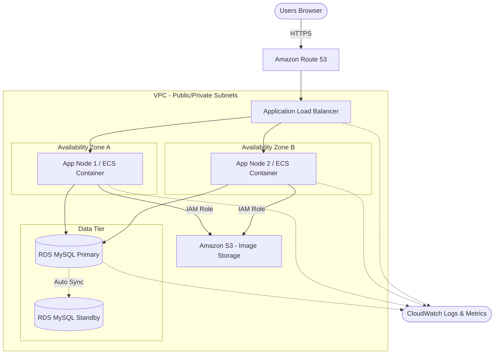

# Phase 2 Architecture — Growth (30,000 DAU)

---

## Design Philosophy

Eliminate single points of failure. The system now serves a real enterprise with multi-branch operations. Downtime costs real money. Focus on: HA, monitoring, zero-downtime deployment, and proper image storage.

---

## What Changed (Bottlenecks Measured)

| Problem | Symptom | Solution |
|---------|---------|----------|
| Single server = SPOF | Any failure = total outage | Add load balancer + 2 AP nodes |
| DB = SPOF | DB crash = total outage | RDS Multi-AZ (automatic failover) |
| Image storage on local disk | Disk full; images lost on server failure | Migrate to S3 |
| No monitoring | Learn about outages from user complaints | Add CloudWatch + alerting |
| Manual deployment | Downtime during deploys | Containerize + rolling updates |
| Search slowing on 200K assets | Queries > 200ms with complex filters | Add proper indexes; consider Redis cache for hot queries |

---

## Application Architecture

**Pattern:** Modular Monolith (unchanged, but containerized)

The monolith is still appropriate. At ~4 QPS peak, there is no throughput reason to split into microservices. The modules remain the same, but the deployment model changes.

---

## System Architecture

```
                         ┌──────────┐
                         │  Users   │
                         │ (Browser)│
                         └────┬─────┘
                              │ HTTPS
                         ┌────▼──────┐
                         │ Route 53  │  DNS
                         └────┬──────┘
                              │
                         ┌────▼──────┐
                         │   ALB     │  Application Load Balancer
                         │ (AWS ELB) │  (health checks, SSL termination)
                         └────┬──────┘
                       ┌──────┴─────┐
                  ┌────▼────┐  ┌────▼────┐
                  │  EC2-1  │  │  EC2-2  │   Stateless AP nodes
                  │  (App)  │  │  (App)  │   (Docker containers)
                  └────┬────┘  └────┬────┘
                       │            │
              ┌────────┴────────────┴────────┐
              │                              │
         ┌────▼────┐                   ┌─────▼────┐
         │  RDS    │                   │    S3    │
         │  MySQL  │                   │  (images)│
         │ Multi-AZ│                   └──────────┘
         │ (primary│
         │+standby)│
         └─────────┘
```



---

## Database Architecture

**RDS MySQL Multi-AZ** provides:
- Automatic failover to standby (typically < 60 seconds)
- Automated daily backups with point-in-time recovery
- No read replica yet (QPS too low to justify the cost)

**Indexes added for Phase 2 query patterns:**
- `assets`: composite index on `(status, category)`, `(department, location)`, `(responsible_person_id)`
- `repair_requests`: composite index on `(status, created_at)`, `(asset_id, status)`

---

## Caching Strategy

At 30,000 DAU and ~4 QPS peak, caching is not strictly necessary for performance. However, if search/filter queries become slow due to complex multi-dimensional filters on 200K assets:

- **Option A (recommended for Phase 2):** Optimize SQL queries and indexes first. This is sufficient.
- **Option B (if measured bottleneck):** Add ElastiCache Redis for caching frequently-accessed asset lists and search results. TTL of 60 seconds. Cache invalidation on write.

---

## Zero-Downtime Deployment

**Strategy:** Rolling update via ECS (Elastic Container Service) or a simple blue-green with ALB target groups.

```
Deployment Flow:
1. Build new Docker image, push to ECR
2. ECS service creates new task with new image
3. ALB health check passes on new task
4. ALB drains connections from old task
5. Old task terminates
6. Zero downtime achieved
```

---

## Monitoring & Observability

| Component | Tool | Purpose |
|-----------|------|---------|
| Metrics | CloudWatch | CPU, memory, disk, request count, latency |
| Logs | CloudWatch Logs | Centralized application logs |
| Alerts | CloudWatch Alarms + SNS | CPU > 80%, error rate > 1%, health check fail |
| Health Check | ALB target group health check | `/health` endpoint on each AP node |
| Uptime | CloudWatch Synthetics (optional) | Periodic canary checks |

---

## AWS Infrastructure & Cost Estimate

| Resource | Service | Spec | Monthly Cost |
|----------|---------|------|-------------|
| AP nodes (×2) | EC2 | t4g.medium (2 vCPU, 4 GB) | ~$62 |
| Load Balancer | ALB | 1 ALB | ~$22 |
| Database | RDS MySQL | db.t4g.medium, Multi-AZ | ~$95 |
| Storage (DB) | EBS gp3 | 50 GB | ~$4 |
| Image storage | S3 | ~200 GB (growing) | ~$5 |
| DNS | Route 53 | 1 hosted zone | ~$0.50 |
| Monitoring | CloudWatch | Basic metrics + alarms | ~$10 |
| Container Registry | ECR | 1 repo | ~$1 |
| **Total** | | | **~$200/month** |
