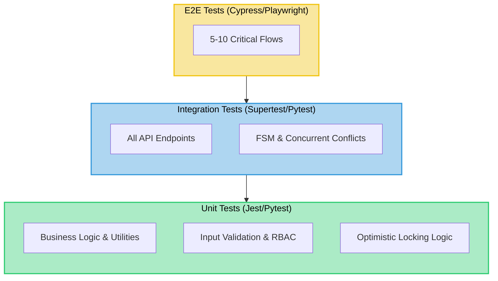

# Testing Strategy

---

## Test Pyramid

```
         ┌─────────┐
         │   E2E   │   5-10 critical flows
         │  Tests  │   (Cypress/Playwright)
       ┌─┴─────────┴─┐
       │ Integration │  API endpoint tests
       │    Tests    │  (supertest / pytest)
      ┌┴─────────────┴┐
      │  Unit Tests   │  Business logic, utilities
      │               │  (Jest / pytest)
      └───────────────┘
```



---

## Test Coverage Targets

| Type | Coverage | Focus Areas |
|------|----------|-------------|
| Unit | > 80% | Optimistic locking logic, status transitions, input validation, authorization checks |
| Integration | All API endpoints | CRUD operations, workflow state machine, concurrent edit handling (409 conflict) |
| E2E | 6 critical flows | Login, submit repair, approve repair, complete repair, asset search, asset registration |

---

## Performance & Reliability Testing

| Test | Tool | Target |
|------|------|--------|
| Load test | k6 / Locust | Sustain expected peak QPS for 10 minutes with P95 < 200ms |
| Stress test | k6 / Locust | Find breaking point (QPS where P95 > 3s or errors > 5%) |
| Soak test | k6 | Run at avg QPS for 2 hours, verify no memory leaks |
| Chaos test (Phase 3) | Kill random pod | Verify system recovers within 60 seconds |

---

## Security Testing (CI Pipeline)

Security checks run as **mandatory CI gates** — PRs are blocked if any gate fails.

### Static Application Security Testing (SAST)

| Tool | What It Catches | Gate |
|------|----------------|------|
| **SonarQube** | Dead code, code smells, SQL injection patterns, XSS sinks, insecure deserialization, duplication | Quality Gate must be `Passed`; zero new `BLOCKER` or `CRITICAL` issues |
| **Semgrep** | Custom rule sets for OWASP Top 10, injection, broken auth, sensitive data exposure | Zero findings at `ERROR` severity |
| **ESLint / Flake8** (linter) | Code style, unused imports, forbidden patterns (e.g. `eval`, `exec`, `innerHTML =`) | Zero lint errors; warnings capped at project threshold |

```yaml
# Example CI step (GitHub Actions)
- name: SonarQube Scan
  uses: SonarSource/sonarqube-scan-action@master
  env:
    SONAR_TOKEN: ${{ secrets.SONAR_TOKEN }}
    SONAR_HOST_URL: ${{ secrets.SONAR_HOST_URL }}

- name: Semgrep
  uses: returntocorp/semgrep-action@v1
  with:
    config: >-
      p/owasp-top-ten
      p/sql-injection
      p/xss

- name: Lint (Node)
  run: npm run lint -- --max-warnings 0

- name: Lint (Python)
  run: flake8 . --max-line-length=120 --extend-ignore=E203
```

### Software Composition Analysis (SCA)

Detect vulnerable or license-violating **third-party dependencies** in both the Node and Python supply chains.

| Tool | Ecosystem | What It Catches |
|------|-----------|----------------|
| **npm audit** | Node / npm | CVEs in `node_modules`; fails on `high` or `critical` severity |
| **pip-audit** | Python / pip | CVEs from OSV and PyPI Advisory Database |
| **Dependabot** (GitHub) | npm + pip | Automated PRs for dependency upgrades; weekly schedule |
| **OWASP Dependency-Check** | Both | Deep CVE matching including transitive deps; HTML report archived as CI artifact |

```yaml
- name: SCA — npm audit
  run: npm audit --audit-level=high

- name: SCA — pip-audit
  run: |
    pip install pip-audit
    pip-audit --requirement requirements.txt --strict

- name: SCA — OWASP Dependency-Check
  uses: dependency-check/Dependency-Check_Action@main
  with:
    project: asset-management-system
    path: .
    format: HTML
    args: --failOnCVSS 7
```

### Secret Scanning

| Tool | Trigger | Blocks PR? |
|------|---------|-----------|
| **GitHub Secret Scanning** | Push / PR | Yes — auto-blocks tokens matching provider patterns |
| **gitleaks** | Pre-commit hook + CI | Yes — scans entire commit history for leaked credentials |

```yaml
- name: Secret Scan (gitleaks)
  uses: gitleaks/gitleaks-action@v2
  env:
    GITHUB_TOKEN: ${{ secrets.GITHUB_TOKEN }}
```

### Security Gate Summary

```
CI Security Pipeline
──────────────────────────────────────────────────
Stage 1 — Secrets:     gitleaks → block on any finding
Stage 2 — SAST:        Semgrep → block on ERROR; SonarQube Quality Gate
Stage 3 — Lint:        ESLint / Flake8 → zero errors
Stage 4 — SCA:         npm audit + pip-audit → block on HIGH/CRITICAL CVE
Stage 5 — Deep SCA:    OWASP Dependency-Check → block on CVSS ≥ 7
──────────────────────────────────────────────────
All stages run in parallel where possible to minimise CI time.
```
