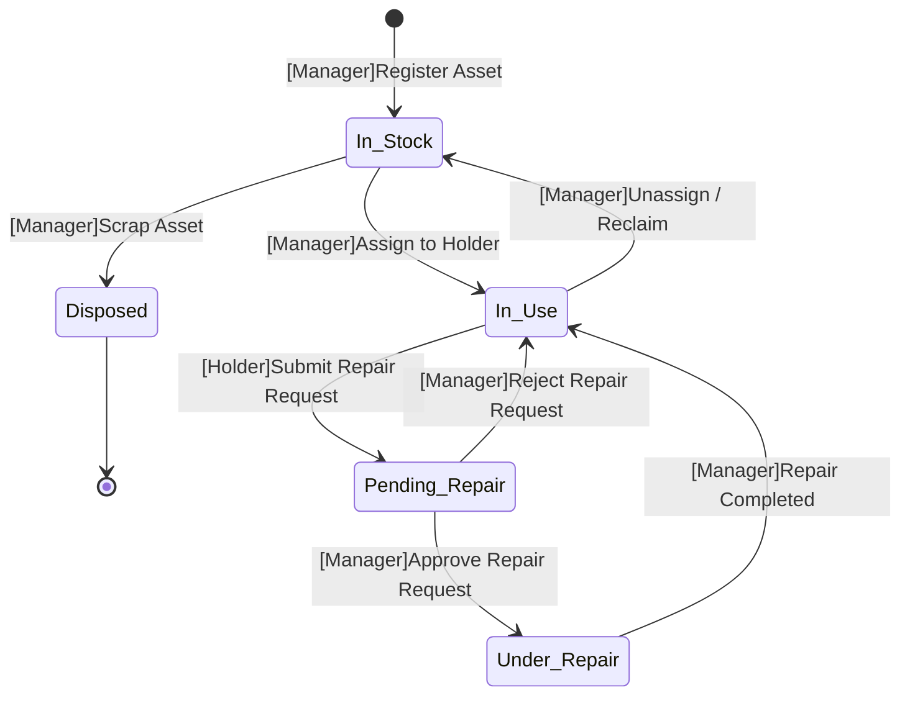

# Asset Finite State Machine

## State Diagram

## State Transition Table

| # | Current State | Valid Action / Trigger | Next State | Validation Rules |
|---|--------------|----------------------|------------|-----------------|
| T1 | — (new) | **Register Asset** *(Manager)* | `In_Stock` | Required fields present (name, model, category, supplier, purchase date, amount). `responsible_person_id` must be NULL. Asset code auto-generated. |
| T2 | `In_Stock` | **Assign to Holder** *(Manager)* | `In_Use` | Target user exists and has role `holder`. `responsible_person_id` is currently NULL. |
| T3 | `In_Stock` | **Scrap Asset** *(Manager)* | `Disposed` | No active repair requests linked. `responsible_person_id` is NULL. Disposal reason provided. |
| T4 | `In_Use` | **Submit Repair Request** *(Holder)* | `Pending_Repair` | Asset has no existing `pending_review` or `under_repair` repair request (no duplicates). Fault description and asset code required. |
| T5 | `In_Use` | **Unassign / Reclaim** *(Manager)* | `In_Stock` | No active repair requests (`pending_review` or `under_repair`). Reason provided. `responsible_person_id` cleared. |
| T6 | `Pending_Repair` | **Approve Repair Request** *(Manager)* | `Under_Repair` | Repair request exists in `pending_review` status. Asset and repair request updated atomically in one transaction. |
| T7 | `Pending_Repair` | **Reject Repair Request** *(Manager)* | `In_Use` | Rejection reason provided. Repair request marked `rejected` atomically. Asset returns to normal use. |
| T8 | `Under_Repair` | **Repair Completed** *(Manager)* | `In_Use` | Repair details filled (date, fault, plan, cost, vendor). Repair request marked `completed` atomically. `responsible_person_id` unchanged. |

**Forbidden transitions** (rejected at service layer): `Pending_Repair → In_Stock`, `Under_Repair → In_Stock`, `In_Stock → Pending_Repair`, `Disposed → *` (any), self-transitions.
