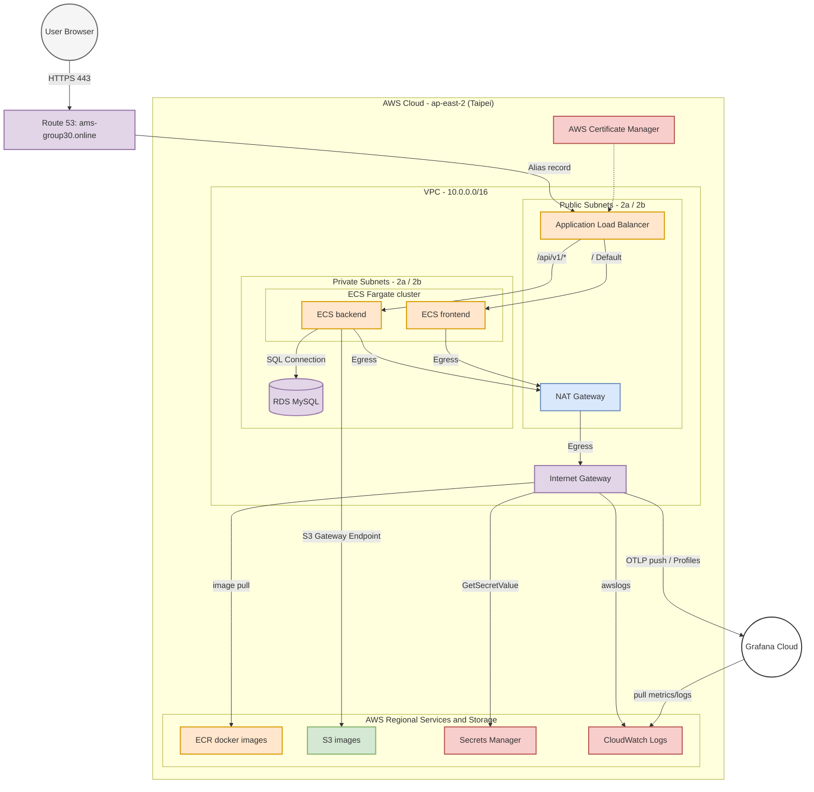

# AWS Infrastructure Reference (Production Baseline)

This document records the manually provisioned AWS infrastructure baseline for the AMS production environment in `ap-east-2`. While ECS task definitions and deployment flows are automated via GitHub Actions, the underlying network and service primitives are operator-managed.

## Architecture Diagram

## VPC Topology (`project-vpc`)

| Attribute | Value |
|-----------|-------|
| VPC ID    | `__VPC_ID__` |
| CIDR Block| `10.0.0.0/16` |
| Region    | `ap-east-2` (Taipei) |

### Subnets

| Name | ID | CIDR | Type | AZ |
|------|----|------|------|----|
| `project-subnet-public1-ap-east-2a` | `__SUBNET_PUBLIC_1__` | `10.0.0.0/20` | Public (ALB) | `ap-east-2a` |
| `project-subnet-public2-ap-east-2b` | `__SUBNET_PUBLIC_2__` | `10.0.16.0/20` | Public (ALB) | `ap-east-2b` |
| `project-subnet-private1-ap-east-2a` | `__SUBNET_PRIVATE_1__` | `10.0.128.0/20`| Private (App/DB) | `ap-east-2a` |
| `project-subnet-private2-ap-east-2b` | `__SUBNET_PRIVATE_2__` | `10.0.144.0/20`| Private (App/DB) | `ap-east-2b` |

## Routing & Internet Egress

The AMS production environment uses a standard hub-and-spoke routing model to provide internet access to tasks running in private subnets (which do not have public IP addresses).

| Component | Configuration |
|-----------|---------------|
| **Internet Gateway** | Attached to `project-vpc` to provide entry/exit for the public subnets. |
| **NAT Gateway** | A single NAT Gateway resides in `project-subnet-public1-ap-east-2a`. |
| **Public Route Table** | Routes `0.0.0.0/0` to the Internet Gateway. |
| **Private Route Table** | Routes `0.0.0.0/0` to the NAT Gateway; routes S3 traffic to the VPC Endpoint. |
| **VPC Endpoint (S3)**  | A Gateway Endpoint (`project-vpce-s3`) attached to private subnets. |

### Egress Path

ECS tasks (Backend, Frontend) and RDS instances reside in the private subnets. Their outbound traffic follows these paths:

1.  **S3 Traffic**: **Private Subnet** -> **VPC Gateway Endpoint** -> **S3 Service** (AWS internal network).
2.  **Other AWS Services**: **Private Subnet** -> **NAT Gateway** (Public Subnet) -> **IGW** -> **Service Endpoints** (ECR, Secrets Manager, CloudWatch).
3.  **External Internet**: **Private Subnet** -> **NAT Gateway** -> **IGW** -> **Public Internet** (e.g., Grafana Cloud).

*Note: The S3 Gateway Endpoint is used to optimize cost and performance for image storage traffic. Other AWS regional services currently rely on the NAT Gateway for simplicity, but could be migrated to Interface Endpoints in future hardening iterations.*

---

## Load Balancing (`ams-alb`)

- **Scheme**: Internet-facing
- **DNS**: `__ALB_DNS_NAME__`
- **Security Group**: `ams-alb-sg` (`__SG_ALB_ID__`)

### Listeners & Routing

| Port | Protocol | Action | Target Group / Redirect |
|------|----------|--------|--------------------------|
| 80   | HTTP     | Redirect | `HTTPS://#{host}:443/#{path}?#{query}` (301) |
| 443  | HTTPS    | Forward  | Path `/api/v1/*` -> `ams-backend-tg` |
| 443  | HTTPS    | Forward  | Default -> `ams-frontend-tg` |

### Target Groups

| Name | Port | Health Check Path | Success Code |
|------|------|-------------------|--------------|
| `ams-backend-tg` | 8000 | `/ready` | 200 |
| `ams-frontend-tg`| 80 | `/` | 200 |

---

## Security Groups (Network ACLs)

| Group Name | ID | Ingress Rules | Egress Rules |
|------------|----|---------------|--------------|
| `ams-alb-sg` | `__SG_ALB_ID__` | 80/443 from `0.0.0.0/0` | All to `0.0.0.0/0` |
| `ams-backend-task-sg` | `__SG_BACKEND_ID__` | 8000 from `ams-alb-sg` | All to `0.0.0.0/0` |
| `ams-frontend-task-sg` | `__SG_FRONTEND_ID__` | 80 from `ams-alb-sg` | All to `0.0.0.0/0` |
| `ams-rds-sg` | `__SG_RDS_ID__` | 3306 from `ams-backend-task-sg` | All to `0.0.0.0/0` |
| `ams-redis-sg` | `__SG_REDIS_ID__` | 6379 from `ams-backend-task-sg` | All to `0.0.0.0/0` |

---

## Storage & Database

### RDS Instance (`ams-database`)

- **Identifier**: `ams-database`
- **Engine**: MySQL 8.4.8
- **Class**: `db.t3.micro` (Bursting enabled)
- **Storage**: 20GB gp2 (Encrypted via KMS)
- **Multi-AZ**: No (Phase 2 constraint)
- **Backup**: 7-day retention, 15:06-15:36 UTC window.
- **Parameter Group**: `default.mysql8.4` (Custom group deferred to Phase 2)
- **Subnet Group**: Includes all 4 VPC subnets (public + private). While `PubliclyAccessible: false` provides isolation, a tighter private-only subnet group is recommended for future hardening.

### S3 Bucket (`__REPAIR_S3_BUCKET__`)

- **Purpose**: Durable storage for repair-request images.
- **Access Model**: Private (no public bucket policy). Access is granted to `ams-backend-task` via IAM.
- **CORS**: Not configured (all reads go through the backend proxy).

---

## IAM Roles

| Role Name | Purpose |
|-----------|---------|
| `ams-ecs-task-execution` | Used by ECS agent to pull images from ECR and fetch secrets from Secrets Manager. |
| `ams-backend-task` | Runtime role for backend; grants S3 read/write to `__REPAIR_S3_BUCKET__`. |
| `ams-frontend-task` | Runtime role for frontend; minimal permissions (logging). |
| `ams-grafana-cloud-reader` | Cross-account role for Grafana Cloud metrics/logs pull. |

---

## Certificates & Domains

- **ACM Certificate**: `arn:aws:acm:ap-east-2:__ACCOUNT_ID__:certificate/__CERTIFICATE_ID__`
- **Domain**: Production traffic is expected at the ALB DNS name or a CNAME pointing to it (e.g., `ams.example.com`).

---

## Known Gaps & Future Hardening

The current baseline represents the initial production deployment. The following items are identified as known gaps to be addressed in future infrastructure iterations:

1. **ALB TLS Policy**: Currently using `ELBSecurityPolicy-2016-08`. Should be upgraded to `ELBSecurityPolicy-TLS13-1-2-2021-06` to disable TLS 1.0/1.1.
2. **Security Group Egress**: All task SGs currently permit `0.0.0.0/0` egress. Egress should be restricted to necessary service endpoints (ECR, Secrets Manager, S3, Grafana Cloud).
3. **ECR Hygiene**: Repositories are currently `MUTABLE` and `scanOnPush: false`. Production best practice is `IMMUTABLE` with scan-on-push enabled.
4. **RDS Multi-AZ**: Currently a Single-AZ deployment. Multi-AZ is required for production HA/SLA (planned for Phase 2).

