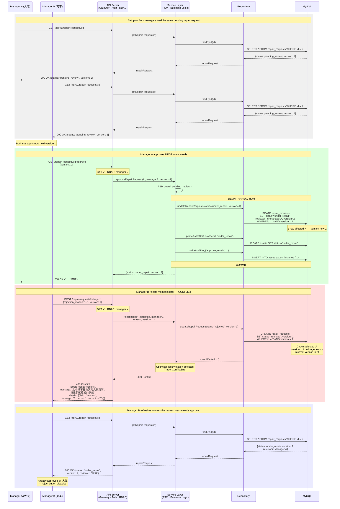

# Sequence Diagrams

Two sequence diagrams covering the system's most architecturally complex scenarios.

---

## Diagram A — Full Repair Lifecycle

**Scenario:** A holder discovers a faulty laptop, submits a repair request, a manager approves the request, fills in repair details from the vendor, and marks the repair complete.

**FSM transitions covered:** T4 (`in_use` → `pending_repair`) → T6 (`pending_repair` → `under_repair`) → T8 (`under_repair` → `in_use`)

**Architectural concerns demonstrated:** JWT authentication, RBAC enforcement, FSM guard validation, duplicate-request prevention, atomic dual-resource state transitions, optimistic locking, and audit logging.

```mermaid
sequenceDiagram
    participant H as Holder (佳慧)
    participant M as Manager (大偉)
    participant API as API Server<br/>(Gateway · Auth · RBAC)
    participant SVC as Service Layer<br/>(FSM · Business Logic)
    participant REPO as Repository
    participant DB as MySQL

    %% ── Phase 1: Submit Repair Request ──────────────────────────
    rect rgb(230, 245, 255)
    Note over H,DB: Phase 1 — Submit Repair Request (T4: in_use → pending_repair)

    H ->> API: POST /api/v1/repair-requests<br/>Authorization: Bearer {jwt}<br/>{asset_id, fault_description}

    Note over API: Rate limit: 100 req/min ✓<br/>JWT signature + expiry ✓<br/>RBAC: role = holder ✓

    API ->> SVC: submitRepairRequest(userId, assetId, description)

    SVC ->> REPO: findAssetById(assetId)
    REPO ->> DB: SELECT * FROM assets<br/>WHERE id = ? AND deleted_at IS NULL
    DB -->> REPO: asset {status: in_use, version: 2,<br/>responsible_person_id: 佳慧}
    REPO -->> SVC: asset

    Note over SVC: FSM guard: status = in_use ✓<br/>Ownership: responsible_person = caller ✓

    SVC ->> REPO: findActiveRepairRequest(assetId)
    REPO ->> DB: SELECT * FROM repair_requests<br/>WHERE asset_id = ?<br/>AND status IN ('pending_review', 'under_repair')
    DB -->> REPO: ∅ (no rows)
    REPO -->> SVC: no active request ✓

    Note over SVC,DB: BEGIN TRANSACTION

    SVC ->> REPO: createRepairRequest(...)
    REPO ->> DB: INSERT INTO repair_requests<br/>(status='pending_review', version=1, ...)

    SVC ->> REPO: updateAssetStatus(assetId, 'pending_repair', version=2)
    REPO ->> DB: UPDATE assets<br/>SET status='pending_repair', version=3<br/>WHERE id = ? AND version = 2
    Note over DB: 1 row affected ✓

    SVC ->> REPO: writeAuditLog('submit_repair', ...)
    REPO ->> DB: INSERT INTO asset_action_histories (...)

    Note over SVC,DB: COMMIT

    SVC -->> API: repairRequest {id, status: pending_review}
    API -->> H: 201 Created
    end

    %% ── Phase 2: Approve Repair Request ─────────────────────────
    rect rgb(255, 245, 230)
    Note over H,DB: Phase 2 — Approve Repair Request (T6: pending_repair → under_repair)

    M ->> API: POST /api/v1/repair-requests/:id/approve<br/>Authorization: Bearer {jwt}<br/>{version: 1}

    Note over API: JWT ✓ · RBAC: role = manager ✓

    API ->> SVC: approveRepairRequest(requestId, managerId, version=1)

    SVC ->> REPO: findRepairRequestById(requestId)
    REPO ->> DB: SELECT * FROM repair_requests WHERE id = ?
    DB -->> REPO: request {status: pending_review, version: 1}
    REPO -->> SVC: repairRequest

    Note over SVC: FSM guard: status = pending_review ✓

    Note over SVC,DB: BEGIN TRANSACTION

    SVC ->> REPO: updateRepairRequest(status='under_repair',<br/>reviewer_id=managerId, version=1)
    REPO ->> DB: UPDATE repair_requests<br/>SET status='under_repair', reviewer_id=?,<br/>version=2 WHERE id = ? AND version = 1
    Note over DB: 1 row affected ✓

    SVC ->> REPO: updateAssetStatus(assetId, 'under_repair', version=3)
    REPO ->> DB: UPDATE assets<br/>SET status='under_repair', version=4<br/>WHERE id = ? AND version = 3
    Note over DB: 1 row affected ✓

    SVC ->> REPO: writeAuditLog('approve_repair', ...)
    REPO ->> DB: INSERT INTO asset_action_histories (...)

    Note over SVC,DB: COMMIT

    SVC -->> API: updated request {status: under_repair, version: 2}
    API -->> M: 200 OK
    end

    %% ── Phase 3: Fill Repair Details ────────────────────────────
    rect rgb(245, 255, 245)
    Note over H,DB: Phase 3 — Fill Repair Details (metadata only, no FSM transition)

    M ->> API: PATCH /api/v1/repair-requests/:id/repair-details<br/>{repair_date, fault_content, repair_plan,<br/>repair_cost, repair_vendor, version: 2}

    Note over API: JWT ✓ · RBAC: role = manager ✓

    API ->> SVC: updateRepairDetails(requestId, details, version=2)

    SVC ->> REPO: findRepairRequestById(requestId)
    REPO ->> DB: SELECT * FROM repair_requests WHERE id = ?
    DB -->> REPO: request {status: under_repair, version: 2}
    REPO -->> SVC: repairRequest

    Note over SVC: Guard: status = under_repair ✓

    SVC ->> REPO: updateRepairDetails(id, details, version=2)
    REPO ->> DB: UPDATE repair_requests<br/>SET repair_date=?, fault_content=?,<br/>repair_plan=?, repair_cost=?,<br/>repair_vendor=?, version=3<br/>WHERE id = ? AND version = 2
    Note over DB: 1 row affected ✓

    SVC -->> API: updated request {version: 3}
    API -->> M: 200 OK
    end

    %% ── Phase 4: Complete Repair ────────────────────────────────
    rect rgb(248, 235, 255)
    Note over H,DB: Phase 4 — Complete Repair (T8: under_repair → in_use)

    M ->> API: POST /api/v1/repair-requests/:id/complete<br/>{repair_date, fault_content, repair_plan,<br/>repair_cost, repair_vendor, version: 3}

    Note over API: JWT ✓ · RBAC: role = manager ✓

    API ->> SVC: completeRepair(requestId, details, version=3)

    SVC ->> REPO: findRepairRequestById(requestId)
    REPO ->> DB: SELECT * FROM repair_requests WHERE id = ?
    DB -->> REPO: request {status: under_repair, version: 3}
    REPO -->> SVC: repairRequest

    Note over SVC: FSM guard: status = under_repair ✓<br/>Required fields all present ✓

    Note over SVC,DB: BEGIN TRANSACTION

    SVC ->> REPO: updateRepairRequest(status='completed',<br/>completed_at=now(), version=3)
    REPO ->> DB: UPDATE repair_requests<br/>SET status='completed',<br/>completed_at='2026-04-20T15:00:00Z',<br/>version=4 WHERE id = ? AND version = 3
    Note over DB: 1 row affected ✓

    SVC ->> REPO: updateAssetStatus(assetId, 'in_use', version=4)
    REPO ->> DB: UPDATE assets<br/>SET status='in_use', version=5<br/>WHERE id = ? AND version = 4
    Note over DB: 1 row affected ✓

    SVC ->> REPO: writeAuditLog('complete_repair', ...)
    REPO ->> DB: INSERT INTO asset_action_histories (...)

    Note over SVC,DB: COMMIT

    SVC -->> API: completed request {status: completed, version: 4}
    API -->> M: 200 OK — asset returns to in_use
    end
```

---

## Diagram B — Optimistic Locking Conflict

**Scenario:** Two managers open the same pending repair request at the same time. Manager A approves it; Manager B attempts to reject it moments later. The system uses optimistic locking (`WHERE version = ?`) to detect the conflict and rejects Manager B's stale write with a `409 Conflict`.

**User story link:** AC US-04 #8 — 「若兩名資產管理人員同時開啟同一張申請單並各自嘗試更新狀態，系統僅接受先送出的一筆操作，後送出者收到提示『此申請單已由其他人員更新，請重新確認當前狀態』」

**Architectural concerns demonstrated:** Concurrent access, optimistic locking version check, `409 Conflict` error response, stale-state recovery (client refresh).

